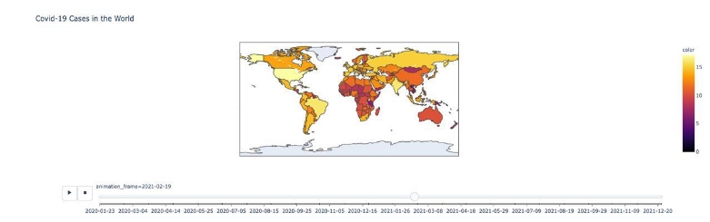
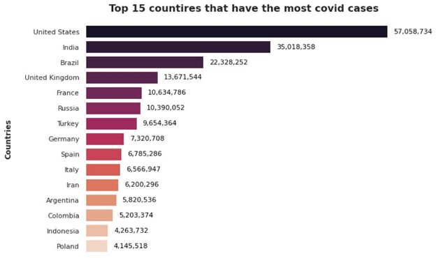
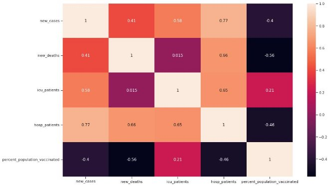

## Abstract
In this project, we visualize the available data and compare different countries with each other. Then, for demonstration purposes, we take Canada for our analysis because in our tests to fit the selected models it is the most difficult country to predict and model, so we will use Canada as an example in the future. We start by visualizing our data and comparing countries to each other, then analyze the vaccine's effect on new cases, we will analyze three presides of pandemic and these results can help to manage the new variants of COVID-19. In the final section of the project, we use **Prophet**, neural **prophet,** and lastly **SARIMAX** models for Time series modeling. The best model was the prophet model with the average accuracy of (16%) compared to (19%) and (26%) predicts New cases with average of Data analysis of COVID-19 patients can be a suitable and practical tool for predicting the mortality of these patients. Given the sensitivity of medical science concerning maintaining human life and lack of specialized human resources in the health system, using the proposed models can increase the chances of successful treatment, prevent early death and re- duce   the costs associated with long treatments for patients, hospitals, and the insurance industry.

**Keywords**

New Cases; COVID-19; Data Mining; Prediction; Prophet; Vaccination; Canada; time series   

## Introduction  

Coronavirus disease 2019 (COVID19) started as a local outbreak in Wuhan, China in December 2019 and has rapidly spread around the world, becoming a global pandemic. A year later, more than 113 million people have been infected with COVID-19, of which 2.5 million have died worldwide.

If coronavirus (COVID19) is not predicted, managed, and controlled in time, the health system of any country and its people will face serious problems. Predictive models can be useful in managing health resources and preventing disease and deaths caused by COVID19. The present study aimed to   predict new COVID19 cases based on a time series model.

To combat the spread of this virus, the Pfizer–BioNTech COVID-19 vaccine was approved in the United Kingdom on December 2, 2020, and the Pfizer–BioNTech and Moderna vaccines were subsequently approved for emergency use authorization in the United States. In light of these recent developments, the potential impact of the distribution of COVID-19 vaccines is tremendous. Giving the public, health officials, and government, model-based trend predictions and additional guidance on effective vaccine distribution and potential problems is critical. Over the past year, many papers have been published on modeling the COVID-19 pandemic.

## Dataset Source & Info  

We used[ Our World In Data ](https://covid.ourworldindata.org/)and 4 preprocessed files.15 We used this data set because it is regularly updated and the quality of the dates is very good. We chose it because it’s one of the best datasets; because it's automated and updated regularly, and it uses reliable sources for each country.

## Data Cleaning and Preparation 

We performed some data cleaning including; checking for countries with mismatch data or   missing data and population data, we dealt with NaN data and checked for duplicate data.

- **Line plot**
- **Confirmed Cases Worldwide with Choropleth Map (log10)** 
- **Cases over the time With Area plot** 

## World Comparison 

Among countries with a population of more than ten million people:

- **The top 15 countries have the most COVID cases.** 
- **Scatter Plot for Deaths vs Confirmed Cases.** 
- **The top 15 European countries have the highest percentage of vaccinated population.** 
- **The top 8 countries in North America have the highest rate of COVID-related population deaths.** 

## Canada COVID Analysis

1. Using a time series, investigate how the percentage of the population that has been vaccinated affects the number of new COVID cases in Canada over time. 
2. According to the time series, examining the new cases in Canada 
- before the vaccination program. 
- between the 1st vaccination date and the date with the lowest number of new cases.  
- after the date with the lowest number of new cases.  
- Examine how the proportion of the population who has been vaccinated affects new deaths, ICU patients, and hospital patients in Canada over time. 

**Canada Covid Analysis** 

We analyze Canada’s dataset to see the relationships between the number of ICU patients, hospital patients, new deaths, and the percentage of the population vaccinated in Canada.  

The below **heatmap** and **pair plot** show that **new cases** are positively related to the number of **hospital patients**, **ICU patients**, **new deaths**, and **the percentage of the population vaccinated** in Canada. 

According to CTV news, the first COVID-19 vaccines administered in Canada is on Dec 14, 2020, the red line in the chart indicates that.

**Three specific period Analysis**

In 3 different periods according to the above time-series analyses, how the relationship changes between the percentage of the population vaccinated and the number of Canadian new COVID cases.

1. Before the 1st vaccination date in Canada. 
1. The second period - between the 1st vaccination date and the date with the lowest number of new cases. 
1. After the date with the lowest number of new cases. 

1) The first period - before the 1st vaccination date in Canada (before 2020-12-14) How did the COVID situation in Canada before the vaccination program? 

**We can see that before the first vaccination date in Canada:** 

- **New COVID cases** were positively associated with **hospital patients** (corr = 0.6), **ICU patients** (corr = 0.65), and **new deaths** (corr = 0.45). 
- The number of **hospital patients** was highly associated with the number of **ICU patients**. 
- **patients** (corr = 0.95), and the number of **new deaths** (corr = 0.88). The number of **ICU patients** was highly associated with the number of **new deaths** (corr = 0.89). 
2) The second period - between the 1st vaccination date and the date with the lowest number of new cases (2020-12-14 ~ 2021-07-01)

How was the situation with COVID in Canada between the 1st vaccination date and the date with the lowest number of new cases? 

**We can see that between the 1st vaccination date and the lowest new case date (2020-12-14 ~ 2021-07-01) in Canada, the percentage of the population that got vaccinated is:**  

- negatively associated with the number of **new COVID cases** (corr= -0.4) 
- negatively associated with **new deaths** (corr= -0.56) 
- negatively associated with **hospital patients** (corr= -0.46) 
- However, it did not decrease the number of **ICU patients** (corr=0.21) at this time. 
3) The third period - after the date with the lowest number of new cases (after 2021-07- 01)

How did the COVID situation in Canada look like after the date with the lowest number of new cases? 

**We can see that after the lowest new case date (after 2021-07-01) in Canada, the percentage of the population that got vaccinated is again:** 

- positively associated with the number of **new COVID cases** (corr=0.47) 
- positively associated with the number of **new deaths** (corr=0.27) 
- positively associated with the number of **ICU patients** (corr=0.49) 
- positively associated with the number of **hospital patients** (corr=0.68) 

Examining how the vaccination rate of the population affects new deaths, ICU patients, and hospital patients in Canada over time

Although there are high and low number changes in the data following the implementation of the vaccine program, the overall trend is still **downward**, particularly in terms of the **number of deaths**. However, as this news points out, we cannot rely solely on vaccines to stop COVID-19. Other safety measures are required. 

## Canada Overview, Holidays, Weekly case distribution analysis  

## Holidays 

We defined a 'holiday' column including Boolean values to check if a day is a holiday or not. We decided to include this column since, after the first analysis, it looks like that on **days after holidays** the **number of new cases decreases**, since on holidays usually **fewer PCR tests are performed**. We can obtain a more accurate forecast by specifying this information to the prediction models.We create a list comprehension to extract the holidays from the holiday’s library, and add Boolean values to a list of holidays depending if the specific date is a holiday (value=1) or not (value=0).

## Weekly case distribution analysis 

Next, we will analyze the weekly distribution to check how the mean, median, and standard deviation of new cases changed during the weeks.  

We can see an **increase in Mean, Median, and Standard Deviation** during the **last 4 weeks.** 

In particular, we can also notice that all these 3 statistics **increased more** during **last week** compared to **2 and 3 weeks ago.** 

## Time series modeling and Forecasting Introduction  

We used three models to forecast our time series. 

## Prophet

“Not all forecasting problems can be solved by the same procedure. Prophet; is optimized for the business forecast tasks we have encountered at Facebook, which typically have any of the following characteristics: 

- hourly, daily, or weekly observations with at least a few months (preferably a year) of history 
- strong multiple “human-scale” seasonality’s: day of week and time of year 
- important holidays that occur at irregular intervals that are known in advance (e.g., the Super Bowl) 
- a reasonable number of missing observations or large outliers 
- historical trend changes, for instance, due to product launches or logging changes 
- trends that are non-linear growth curves, where a trend hits a natural limit or saturates 

We have found Prophet’s default settings to produce forecasts that are often accurate as those produced by skilled forecasters, with much less effort. With Prophet, you are not stuck with the results of a completely automatic procedure if the forecast is not satisfactory — an analyst with no training in time series methods can improve or tweak forecasts using a variety of easily- interpretable parameters. We have found that by combining automatic forecasting with analyst- in-the-loop forecasts for special cases, it is possible to cover a wide variety of business use- cases.” 

**Prophet makes it much more straightforward to create a reasonable, accurate forecast.** The forecast package includes many different forecasting techniques (ARIMA, exponential smoothing, etc), each with its strengths, weaknesses, and tuning parameters. We have found that choosing the wrong model or parameters can often yield poor results, and it is unlikely that even experienced analysts can choose the correct model and parameters efficiently given this array of choices. 

## How Prophet works 

At its core, the Prophet procedure is an[**additive regression model** ](https://en.wikipedia.org/wiki/Additive_model)with four main components: 

- A piecewise linear or logistic growth curve trend. Prophet automatically detects changes in trends by selecting changepoints from the data. 
- A yearly seasonal component modeled using Fourier series. 
- A weekly seasonal component using dummy variables. 
- A user-provided list of important holidays. 

Prophet will provide a components plot that graphically describes the model it has fit: 

The above plot more clearly shows the yearly seasonality associated with browsing to Peyton Manning’s page (football season and the playoffs), as well as the weekly seasonality: more visits on the day of and after games (Sundays and Mondays). You can also notice the downward adjustment to the trend component since he has retired recently. 

The important idea in Prophet is that by doing a better job of fitting the trend component very flexibly, we more accurately model seasonality and the result is a more accurate forecast. We prefer to use a very flexible regression model (somewhat like curve-fitting) instead of a traditional time series model for this task because it gives us more modeling flexibility, makes it easier to fit the model, and handles missing data or outliers more gracefully. 

By default, Prophet will provide uncertainty intervals for the trend component by simulating future trend changes to your time series. If you wish to model uncertainty about future seasonality or holiday effects, you can run a few hundred HMC iterations (which takes a few minutes) and your forecasts will include seasonal uncertainty estimates. 

## Neural Prophet

Neural Prophet improves on Prophet by addressing its key shortcomings: extensibility of the framework, missing local context for predictions, and forecast accuracy.  

1. Neural Prophet is highly scalable, easy to use, and extensible, as it is built entirely in PyTorch and trained with standard deep learning methods.  
2. Neural Prophet introduces local context with support for auto-regression and lagged covariates. 
3. Neural Prophet improves forecast accuracy with a hybrid model, where some model components can be configured as neural networks. 

The framework provides automatic hyperparameter selection, making it a convenient and accessible tool for beginners. Advanced forecasting practitioners can incorporate domain knowledge and leverage deeper expertise with a superset of custom modules, model weight stratification, and global modeling capabilities. 

Neural Prophet includes all the components from the original Prophet model: trend, seasonality, recurring events, and regressors. Further, Neural Prophet now also provides support for auto- regression and lagged covariates. That's particularly relevant in the kinds of applications in which the near-term future depends on the current state of the system. The majority of time series forecasting exhibits those dynamics, evidenced in scenarios related to energy consumption, traffic patterns, air quality measures, and much more. For example, when there’s a strong uptick in server load, it might have been triggered by a recent event that could continue for prolonged periods, which should be reflected in near-term forecasts. 

## SARIMAX 

Among the most ‘seasoned’ techniques for time series forecast, there is ARIMA, which is the acronym for **Auto-Regressive** Integrated Moving Average. Even though ARIMA has shown evidence for working fairly, it has the major pitfall of not being able to handle seasonality. 

SARIMAX stands for ‘Seasonal **Auto-Regressive** Integrated Moving Average with eXogenous factors. 

Accordingly, SARIMAX represents an ‘upgrade’ to the seasoned ARIMA model. In a nutshell, such an upgrade is performed for adding seasonality and exogenous factors. 

To fit a SARIMAX, we need to define values for parameters p, d, and q, where: 

- p is the number of autoregressive terms 
- d is the number of non-seasonal differences needed for stationarity 
- q is the number of lagged forecast errors in the prediction equation 

Before starting the modeling, we first check the time series' stationarity performing the Augmented Dickey-Fuller test (ADF), also to understand the best value for the D parameter of the model (integrative term). The p-value is higher than 0.05. This means that the time series is nonstationary with a confidence of 95%. Next, we will check if, with a one-step differentiation, the time series become stationary (in terms of a trendless time series). 

## ACF AND PACF 

To have a better idea of possible the autoregressive parameter (p) and moving average parameter (q) of the SARIMAX model, we can check the auto-correlation function (ACF) and partial autocorrelation function (PACF). 

The series looks indeed nonstationary from these plots, and we cannot easily identify good values of p and q. For this reason, we will use the convenient auto Arima module to find good parameters for the SARIMAX model. 

## Time series modeling and Forecasting 

The following section is about modeling daily COVID19 cases in Canada by Machine Learning algorithms, with the goal of forecasting the cases for future days.                                                   The time series modeling will be performed by Prophet by Facebook, Neural Prophet, and SARIMAX models. 

With the spreading of **Omicron cases** in Canada, we can see a **very high increase of cases** starting December 20, with a steep increasing trend overall week (Dec 20-Dec 27th). We can see that the new omicron variant is making the forecasting more unpredictable. 

## Prophet 

At a first glance, we can see that the predicted time series (in blue) fits well with the original data (black dots). 

**Plots analysis:**

- Trend: We can see the trends of the 5 covid waves: the steeper one is around October 2020. 
- Holidays: We can see the effects of holidays on the number of new cases. 
- Weekly seasonality: We can observe the drop of cases on Monday, since on Sunday fewer tests are carried, and an overall increase over the week, with the highest number of positive cases found around Friday. 
- Yearly seasonality: We can observe the drop in cases from May to November, seen both in 2020 and 2021. 

## Neural Prophet 

These components are comparable to those obtained using Prophet. 

We can see that there are 7 different heat prediction columns as a consequence of the chosen n_lags parameter. 

Overall, the forecasted **new cases** are **lower** compared to those of **Prophet**. We can also notice that the number of **predicted** cases **decreases** a lot after the 25th and 26th of December since both days are **holidays**. 

## SARIMAX 
### AUTO ARIMA 

The above plots indicate a good but improvable model. This is probably due to the high variability of the time series among the different waves. In particular, we can see an outlier that degrades the fit: this is probably related to December 26th, when COVID cases dropped from 55k (Dec 25th) to 25k. 

## SARIMAX FORECASTING 

## Model analyzing  

We used **(MAPE)** and **(RMSE)** to measure the accuracy and error of our forecast: 

### MAPE 

Mean absolute percentage error (MAPE), is a measure of prediction accuracy of a forecasting method in statistics. Mean absolute percentage error is commonly used as a loss function for regression problems and in model evaluation, because of its very intuitive interpretation in terms of relative error. 

|Country |Prophet |Neural Prophet  |SARIMA |
| - | - | - | - |
|Canada |26\.6 |28\.1 |33\.8 |
|Italy |11\.5 |15 |20\.9 |
|Germany |14\.7 |16 |24\.6 |

RMSE 

Root Mean Square Error (RMSE) is the standard deviation of the residuals (prediction errors). Residuals are a measure of how far from the regression line data points are; RMSE is a measure of how to spread out these residuals are. In other words, it tells you how concentrated the data is around the line of best fit. Root mean square error is commonly used in climatology, forecasting, and regression analysis to verify experimental results. 

We fitted our model to Germany, Italy, Canada and will compare the result of different models to see how they performed. (Lower number is better)  

Country |Prophet |Neural Prophet  |SARIMA |
| - | - | - | - |
|Canada |10,725.22 |14,200.34 |17,130.91 |
|Italy |6524\.199 |5116\.83 |10676\.53 |
|Germany |4701\.29 |6168\.06 |8372\.59 |

Results Summary 

Overall, we can see that the average predicted values fit well with the last 3 weeks' data. Moreover, we can see the weekly trend and holiday effect on forecasted values. 

We can see that Neural Prophet and SARIMAX predict and forecast similar values, which are lower compared to those predicted and forecasted by Prophet. 

All three algorithms performed well on the last 3 weeks of data compared to the actual values, with similar predicted cases. 

On the other hand, the forecasted values differ a bit among the three algorithms, where **Prophet** predicts **higher cases** for the **next days** than **SARIMAX** and **Neural Prophet.** 

After testing the algorithms on several days, it looks like **Prophet** gives the **best results**: for example, on Dec 30th it predicted a **rise in cases** from **98k** to **130k**, whereas the **actual cases** resulted to be **126k** (just **4k fewer** cases than those predicted by Prophet). On that day, the **other algorithms** predicted **less than 100k cases**. 

However, tomorrow's new cases may be lower than today, contrarily to the Prophet's increasing number of cases. The reason is that today, **Jan 1st,** is a **holiday** and **fewer tests** are performed** during holidays. For this reason, **we are expecting the number of tomorrow's new cases to be lower than today’s value of 140k (or similar) and not around 200k like Prophet forecasted.** 

